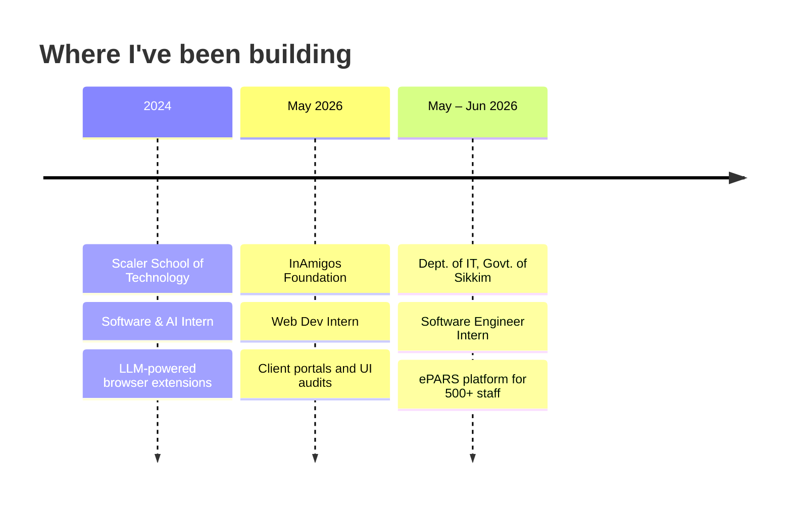

<!-- Profile README for github.com/filedotclose/filedotclose -->

<div align="center">


<a href="https://github.com/filedotclose">
  
</a>

<br/>

[](https://linkedin.com/in/filedotclose)
[](mailto:sujalagarwaljrt@gmail.com)


</div>

---

## 👨‍💻 About Me

```ts
const sujal = {
  role: "Software Engineer Intern @ Dept. of IT, Govt. of Sikkim",
  studying: "B.Tech CSE @ KIIT University (2024 – 2028)",
  cgpa: 9.95,
  base: "Bhubaneswar, India 🇮🇳",
  currentlyBuilding: ["full-stack products", "AI-powered automations"],
  olympiad: "All India Rank 8 — Bloom National Olympiad of Computer Science",
  leadership: ["Web Dev Lead @ ELABS", "Graphic Design Lead @ Kalliope"],
  funFact: "Co-organized North Bengal's first-ever Tech Fest 🎪",
  lookingFor: "Internships & projects where I can ship real things",
};
```

---

## 🛠️ Tech Stack

**Languages**


**Frontend**


**Backend & Databases**


**DevOps, Cloud & AI**


---

## 🚀 Featured Projects

<table>
  <tr>
    <td width="50%" valign="top">

### 🎟️ [Campus Gatepass](https://github.com/filedotclose/Campus-Gatepass)
Transit management for hostel & library access. Strict **RBAC** for guard checkpoints, with endpoints built to plug straight into biometric devices. Stress-tested with **500 simulated concurrent users**.

`Node.js` `Express` `MongoDB` `JWT` `TypeScript`

    </td>
    <td width="50%" valign="top">

### ☕ [KIIT Kafe](https://github.com/filedotclose/ONLINE-KAFE)
Campus dining app with **Redux Toolkit** state, real-time cart persistence and fast checkout, plus an admin dashboard for live inventory and kitchen fulfilment tracking.

`React` `Redux Toolkit` `Node.js` `MongoDB` `TypeScript`

    </td>
  </tr>
  <tr>
    <td width="50%" valign="top">

### 🏠 [Korridor](https://github.com/filedotclose/Korridor)
Mobile-first hostel portal for onboarding, room assignments and grievance tickets. Server components + MongoDB indexing keep resident dashboards at **sub-second** query times.

`Next.js` `TypeScript` `MongoDB` `Tailwind CSS`

    </td>
    <td width="50%" valign="top">

### 🎬 Automated AI YouTube Pipeline
End-to-end AWS pipeline: topic research → **Gemini 2.0 Flash** scripts → B-roll from Pexels → voice synthesis → YouTube upload, scheduling and tagging via **n8n**. Zero manual steps.

`Python` `n8n` `Gemini API` `AWS` `YouTube Data API v3`

    </td>
  </tr>
  <tr>
    <td width="50%" valign="top">

### 💸 [Expense Tracker](https://github.com/filedotclose/expense-tracker)
An installable **PWA** for tracking your expenses on the go.

`JavaScript` `PWA`

    </td>
    <td width="50%" valign="top">

### 🛒 [Amazon Clone](https://github.com/filedotclose/Amazon-Clone)
Pixel-faithful HTML & CSS recreation of the Amazon.com home page.

`HTML` `CSS`

    </td>
  </tr>
</table>

---

## 💼 Experience



| Role | Highlights |
|---|---|
| **Software Engineer Intern**, Dept. of IT, Govt. of Sikkim | Built features for the **ePARS** appraisal platform (Next.js + Django) serving 500+ staff · **JWT + TOTP** auth with RBAC/ABAC · Dockerized services and CI/CD, cutting build times by **67%** |
| **Web Development Intern**, InAmigos Foundation | Shipped responsive client portals, audited codebases, fixed rendering bottlenecks and mobile accessibility |
| **Software & AI Intern**, Scaler School of Technology | Built browser extensions and web utilities wired to LLM endpoints for in-browser workflows and query parsing |

---

## 📊 GitHub Stats

<div align="center">


</div>

---

## 🏆 Highlights

- 🥇 **All India Rank 8**, Bloom National Olympiad of Computer Science
- 🎓 **9.95 CGPA** at KIIT University
- 🛡️ Built **JWT + TOTP** auth with RBAC/ABAC for a government appraisal platform
- 🎪 Co-organized **North Bengal's inaugural Tech Fest**
- 🎤 Multiple awards at **Model UN** conferences
- 🧑‍🏫 Mentored developers as Web Development Lead at **ELABS**

<div align="center">


</div>

<details>
<summary>🔌 <b>Fun facts</b></summary>

- I like automating anything I have to do twice
- Design is a hobby too: I lead graphic design at Kalliope
- Lowkey bored in life and trying to get up with the world, ngl

</details>

---

## 📫 Let's Connect

<div align="center">

[](https://linkedin.com/in/filedotclose)
[](mailto:sujalagarwaljrt@gmail.com)
[](https://github.com/filedotclose)


</div>
